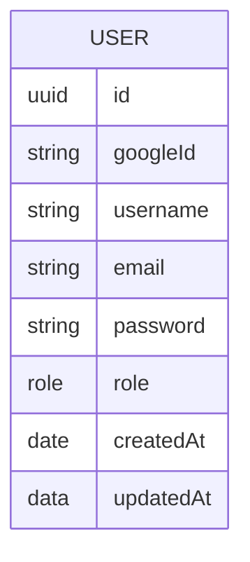
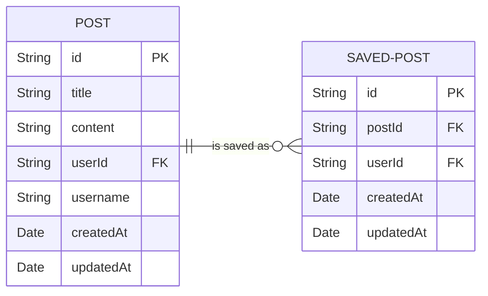

```mermaid
erDiagram
    USER {
        uuid id
        string googleId
        string username
        string email
        string password
        role role
        date createdAt
        data updatedAt
    }
```

```mermaid
erDiagram
    direction LR
    POST ||--o{ SAVED-POST : "is saved as"
    POST {
        String id PK
        String title
        String content
        String userId FK
        String username
        Date createdAt
        Date updatedAt
    }
    SAVED-POST {
        String id PK
        String postId FK
        String userId FK
        Date createdAt
        Date updatedAt
    }
    
```